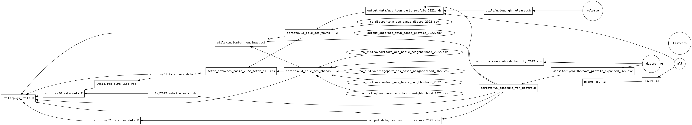

<!-- README.md is generated from README.Rmd. Please edit that file -->

```{r setup, include = FALSE}
knitr::opts_chunk$set(
  collapse = TRUE,
  comment = "#>",
  echo = FALSE
)
```

# 2021 ACS update + community profiles

Distribution-ready files are in [`to_distro`](to_distro). CSV file for populating website's community profiles is in [`website`](website).

## Output

```{r comment=""}
files <- data.frame(file = paste(".", list.files(c("fetch_data", "output_data", "to_distro", "website"), full.names = TRUE), sep = "/"))

print(data.tree::FromDataFrameTable(files, pathName = "file"))
```


## Development

Several global functions and other objects are loaded when each script sources `utils/pkgs_utils.R`, including all loaded libraries. There are two global variables for years: `yr` and `cws_yr`, for the ACS endyear and the CWS year, respectively. Those are both taken as positional arguments by `pkgs_utils.R` and passed down to whatever script you want to run. 

For example, on the command line run:

```bash
Rscript scripts/03_calc_acs_towns.R 2021 2021
```

to execute that script for ACS year 2021 & CWS year 2021. Similarly, those 2 variables are saved in the makefile and passed to scripts from there.

To build the full project in the proper order, on the command line run:

```bash
make
# or make all
```

or rebuild just once piece of it, e.g. `make distro_nhood`.

You can supply the years to `make`; calling `make testvars` will verify what years are being used by sourcing just `utils/pkgs_utils.R`.


```{bash include=FALSE}
makefile2dot -d RL | dot -Tpng -o make.png
```




