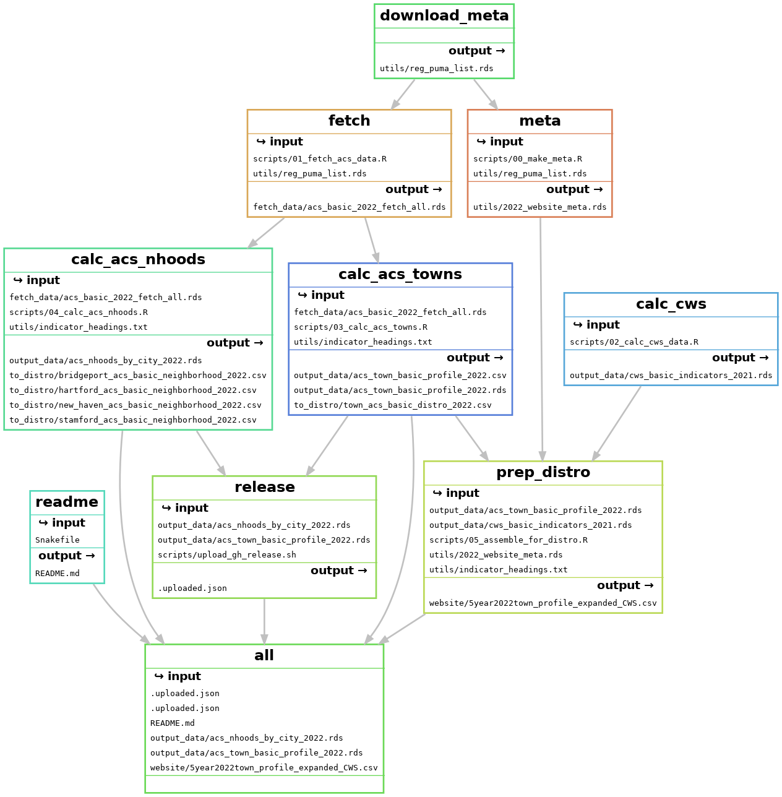

<!-- README.md is generated from README.Rmd. Please edit that file -->

# 2021 ACS update + community profiles

Distribution-ready files are in [`to_distro`](to_distro). CSV file for
populating website’s community profiles is in [`website`](website).

## Output

                                    levelName
    1 .                                      
    2  ¦--output_data                        
    3  ¦   ¦--acs_town_basic_profile_2022.csv
    4  ¦   ¦--acs_town_basic_profile_2022.rds
    5  ¦   °--cws_basic_indicators_2021.rds  
    6  °--to_distro                          
    7      °--town_acs_basic_distro_2022.csv 

## Development

Several global functions and other objects are loaded when each script
sources `utils/pkgs_utils.R`, including all loaded libraries. There are
two global variables for years: `yr` and `cws_yr`, for the ACS endyear
and the CWS year, respectively. Those are both taken as positional
arguments by `pkgs_utils.R` and passed down to whatever script you want
to run.

For example, on the command line run:

``` bash
Rscript scripts/03_calc_acs_towns.R 2021 2021
```

to execute that script for ACS year 2021 & CWS year 2021. Similarly,
those 2 variables are saved in the makefile and passed to scripts from
there.

To build the full project in the proper order, on the command line run:

``` bash
snakemake all --cores 2 # or more cores if you can
```

or rebuild just once piece of it,
e.g. `snakemake prep_distro --cores 2`.

Calling `snakemake testvars --cores 2` will verify what years are being
used by sourcing just `utils/pkgs_utils.R`.

Additionally, this repo has a release of data in order to have a single
source of the year’s ACS data for other projects. To create and upload
the release, run:

``` bash
snakemake release --cores 2
```

<figure>

<figcaption aria-hidden="true">snakefile</figcaption>
</figure>
